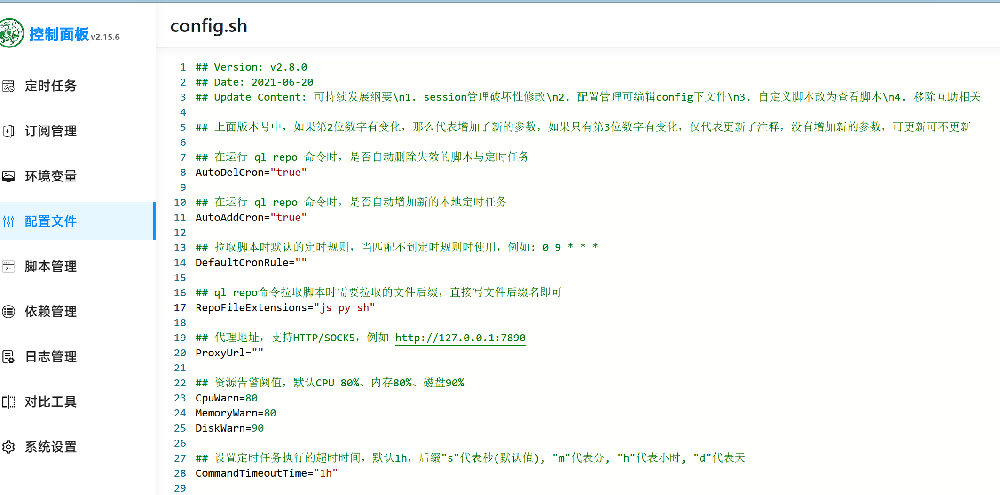

------
# 目录

- [目录](#目录)
- [安装Docker环境](#安装docker环境)
- [常用Docker操作](#常用docker操作)
  - [镜像导入/导出](#镜像导入导出)
  - [更改镜像储存位置](#更改镜像储存位置)
- [Docker应用](#docker应用)
  - [青龙面板(自动化助手)](#青龙面板自动化助手)
    - [青龙面板基础命令](#青龙面板基础命令)
    - [部署BiliBiliTool (B站自动任务工具)](#部署bilibilitool-b站自动任务工具)
  - [qbittorrent (磁链下载)](#qbittorrent-磁链下载)
  - [bitwarden (密码管理器)](#bitwarden-密码管理器)
  - [YesPlayMusic (高颜值的第三方网易云播放器)](#yesplaymusic-高颜值的第三方网易云播放器)
  - [reader (阅读网页版)](#reader-阅读网页版)

------

# 安装Docker环境

- 更新软件包索引，并且安装必要的依赖软件，来添加一个新的 HTTPS 软件源
  ```
  sudo apt update
  sudo apt install apt-transport-https ca-certificates curl gnupg-agent software-properties-common
  ```
- 使用下面的 curl 导入源仓库的 GPG key：
  ```
  curl -fsSL https://download.docker.com/linux/ubuntu/gpg | sudo apt-key add -
  ```
- 将 Docker APT 软件源添加到你的系统：
  ```
  sudo add-apt-repository "deb [arch=amd64] https://download.docker.com/linux/ubuntu $(lsb_release -cs) stable"
  ```
- 现在，Docker 软件源被启用了，你可以安装软件源中任何可用的 Docker 版本。

- 想要安装 Docker 最新版本，运行下面的命令。
  ```
  sudo apt update
  sudo apt install docker-ce docker-ce-cli containerd.io
  ```
- 运行`sudo apt update`可能会有`Warning`
  解决方法参考[ubuntu 22.04 修复 key is stored in legacy trusted.gpg keyring](https://blog.csdn.net/jiang_huixin/article/details/127186567)
- 以非 Root 用户身份执行 Docker
  ```
  sudo usermod -aG docker $USER
  ```

# 常用Docker操作
## 镜像导入/导出
- 查看宿主机所有镜像
  ```
  docker images
  ```
<div align=center></div>

- 使用`save`命令，通过镜像id导出镜像到宿主机当前文件夹下
  ```
  docker save -o qinglong.tar whyour/qinglong:latest
  ```
<div align=center></div>

- 执行以下命令进行镜像导入
  ```
  docker load < qinglong.tar
  ```

## 更改镜像储存位置
- 默认情况下 Docker 容器的存放位置在`/var/lib/docker`目录下面
- 可以通过下面命令查看具体位置
  ```
  sudo docker info | grep "Docker Root Dir"
  ```
- 解决默认存储容量不足的情况，最直接且最有效的方法就是挂载新的分区到该目录。但是在原有系统空间不变的情况下，所以采用软链接的方式，修改镜像和容器的存放路径达到同样的目的。
  ```
  # 停掉Docker服务
  $ systemctl restart docker

  # 停掉Docker服务
  $ service docker stop
  ```
- 然后移动整个`/var/lib/docker`目录到空间不较大的目的路径。这时候启动 `Docker` 时发现存储目录依旧是 `/var/lib/docker` 目录，但是实际上是存储在数据盘 `/data/docker` 上了
  ```
  # 移动原有的内容
  $ mv /var/lib/docker /data/docker

  # 进行链接
  $ ln -sf /data/docker /var/lib/docker
  ```

# Docker应用
## 青龙面板(自动化助手)
1. 在dockers官方镜像列表中拉取最新版的青龙镜像
  ```
  docker pull whyour/qinglong:latest
  ```
2. 创建青龙面板容器，容器名qinglong文件夹名ql 端口5700
  ```
  # 复制下列命令在ssh执行(先安装docker)
  # 注:$PWD请修改为实际你想安装的路径
  不想修改的，直接复制
  docker run -dit \
    -v $PWD/ql/config:/ql/config \
    -v $PWD/ql/log:/ql/log \
    -v $PWD/ql/db:/ql/db \
    -v $PWD/ql/repo:/ql/repo \
    -v $PWD/ql/raw:/ql/raw \
    -v $PWD/ql/scripts:/ql/scripts \
    -v $PWD/ql/jbot:/ql/jbot \
    -p 5700:5700 \
    --name qinglong \
    --hostname qinglong \
    --restart unless-stopped \
    whyour/qinglong:latest
  ```
3. 访问http://服务器IP:5700进行面板配置

4. 如果没有进入配置向导，请在SSH终端下执行如下命令查看账号及密码
  ```
  docker exec -it qinglong cat /ql/config/auth.json
  ```
### 青龙面板基础命令
  ```
  #重启青龙容器
  docker restart 你的容器名

  #更新青龙
  docker exec -it qinglong ql update

  #更新青龙并编译
  docker exec -it qinglong ql restart

  #拉取自定义仓库
  docker exec -it qinglong ql repo https://ghproxy.com/https://github.com/whyour/hundun.git "quanx" "tokens|caiyun|didi|donate|fold|Env"

  #拉取单个脚本
  docker exec -it qinglong ql raw https://ghproxy.com/https://raw.githubusercontent.com/moposmall/Script/main/Me/jx_cfd.js

  #删除7天前的所有日志
  docker exec -it qinglong ql rmlog 7

  #启动bot
  docker exec -it qinglong ql bot

  #导出互助码
  docker exec -it qinglong ql code

  #通知测试
  docker exec -it qinglong notify test test

  #立即执行脚本
  docker exec -it qinglong task test.js now

  #并行执行脚本
  docker exec -it qinglong task test.js conc
  ```
### 部署BiliBiliTool (B站自动任务工具)
- [BiliBiliTool项目地址](https://github.com/RayWangQvQ/BiliBiliToolPro)
1. 安装 dotnet 环境
  编辑青龙的 extra.sh 文件，添加如下指令：
  ```
  # 安装 dotnet 环境
  curl -sSL https://ghproxy.com/https://raw.githubusercontent.com/RayWangQvQ/BiliBiliToolPro/main/qinglong/ray-dotnet-install.sh | bash /dev/stdin --no-official
  ```
<div align=center></div>

2. 重启青龙容器，或在宿主机中执行`docker exec -it qinglong bash /ql/data/config/extra.sh`，其中`qinglong`是你的容器名

3. 登录青龙面板并修改配置
  青龙面板，`配置文件`页。
  修改 `RepoFileExtensions="js py"` 为 `RepoFileExtensions="js py sh"`
  保存配置。
<div align=center></div>

4. 在青龙面板中添加拉库定时任务
  订阅管理(没提到的不要动)
  ```
  名称：Bilibili
  类型：公开仓库
  链接：https://github.com/RayWangQvQ/BiliBiliToolPro.git
  定时类型：crontab
  定时规则：2 2 28 * *
  白名单：bili_task_.+\.sh
  文件后缀：sh
  ```
  保存后，点击运行按钮，运行拉库。

5. 在青龙定时任务中，点击运行`bili扫码登录`任务，查看运行日志，扫描日志中的二维码进行登录。
  登录成功后，会将cookie保存到青龙的环境变量中
<div align=center></div>

6. 拉库时，如果服务器在国内，访问GitHub速度慢，可以在仓库地址前加上 `https://ghproxy.com/` 进行加速, 如：`ql repo https://ghproxy.com/https://github.com/RayWangQvQ/BiliBiliToolPro.git "bili_task_"`

7. 在`环境变量`中自定义配置
  - 是否跳过执行任务
    用于特殊情况下，通过配置灵活的开启和关闭整个应用.
    |   TITLE   | CONTENT   |
    | ---------- | -------------- |
    | 值域   | [true,false] |
    | 默认值   | false |
    | 环境变量 | `Ray_Security__IsSkipDailyTask` |
  - 请求B站接口时头部传递的User-Agent
    |   TITLE   | CONTENT   |
    | ---------- | -------------- |
    | 值域   | 字符串，可以F12从自己的浏览器获取 |
    | 默认值   | Mozilla/5.0 (Macintosh; Intel Mac OS X 10_15_3) AppleWebKit/537.36 (KHTML, like Gecko) Chrome/87.0.4280.66 Safari/537.36 Edg/87.0.664.41 |
    | 环境变量   | `Ray_Security__UserAgent` |
  - 是否开启观看视频任务
    |   TITLE   | CONTENT   |
    | ---------- | -------------- |
    | 值域   | [true,false] |
    | 默认值   | true |
    | 环境变量   | `Ray_DailyTaskConfig__IsWatchVideo` |
  - 是否开启分享视频任务
    |   TITLE   | CONTENT   |
    | ---------- | -------------- |
    | 值域   | [true,false] |
    | 默认值   | true |
    | 环境变量   | `Ray_DailyTaskConfig__IsShareVideo` |
  - 每日投币数量
    |   TITLE   | CONTENT   |
    | ---------- | -------------- |
    | 值域   | [0,5]，为安全考虑，程序内部还会做验证，最大不能超过5 |
    | 默认值   | 5 |
    | 环境变量   | `Ray_DailyTaskConfig__NumberOfCoins` |
  - 投币时是否同时点赞
    |   TITLE   | CONTENT   |
    | ---------- | -------------- |
    | 值域   | [true,false] |
    | 默认值   | false |
    | 环境变量   | `Ray_DailyTaskConfig__SelectLike` |
  - 每月几号自动充电
    使用大会员免费赠送的B币券自动充电，如不使用，每个月结束会自动失效。没有B币券或B币券余额不足2，不会进行充电。
    |   TITLE   | CONTENT   |
    | ---------- | -------------- |
    | 值域   | [-1,31]，-1表示不指定，默认月底最后一天；0表示不充电 |
    | 默认值   | -1 |
    | 环境变量   | `Ray_DailyTaskConfig__DayOfAutoCharge` |
  - 每月几号自动领取会员权益
    |   TITLE   | CONTENT   |
    | ---------- | -------------- |
    | 值域   | [-1,31]，-1表示不指定，默认每月1号；0表示不领取 |
    | 默认值   | 1 |
    | 环境变量   | `Ray_DailyTaskConfig__DayOfReceiveVipPrivilege` |
  - 每月几号进行直播中心银瓜子兑换硬币
    |   TITLE   | CONTENT   |
    | ---------- | -------------- |
    | 值域   | [-1,31]，-1表示不指定，默认每月最后一天；-2表示每天；0表示不进行兑换 |
    | 默认值   | -1 |
    | 环境变量   | `Ray_DailyTaskConfig__DayOfExchangeSilver2Coin` |
  - Lv6后开启硬币白嫖模式
    |   TITLE   | CONTENT   |
    | ---------- | -------------- |
    | 值域   | [true,false]，true表示开启，Lv6的账号不会投币 |
    | 默认值   | false |
    | 环境变量   | `Ray_DailyTaskConfig__SaveCoinsWhenLv6` |
  - 推送通知到[PushPlus](http://www.pushplus.plus/)
    |   TITLE   | CONTENT   |
    | ---------- | -------------- |
    | 值域   | 一串字符串 |
    | 默认值   | 空 |
    | 环境变量   | `Ray_Serilog__WriteTo__9__Args__token` |

## qbittorrent (磁链下载)
1. 拉取镜像(4.4.3以上版本可能有bug)
  ```
  docker pull linuxserver/qbittorrent:4.4.3
  ```
2. 创建对应目录并编写 Docker-Compose 文件
  ```
  cd ~/Docker
  mkdir qBittorrent #创建qbitorrent数据文件夹
  cd qBittorrent
  mkdir config downloads #创建配置文件目录与下载目录
  vim docker-compose.yml #创建并编辑文件
  ```
3. vim复制如下内容并按需修改
  ```
  version: "2"
  services:
    qbittorrent:
      image: linuxserver/qbittorrent:4.4.3
      container_name: qbittorrent
      environment:
        - PUID=1000
        - PGID=1000
        - TZ=Asia/Shanghai # 你的时区
        - UMASK_SET=022
        - WEBUI_PORT=8081 # 将此处修改成你欲使用的 WEB 管理平台端口
      volumes:
        - /home/mtchaoyi/Docker/qBittorrent/config:/config # 绝对路径请修改为自己的config文件夹
        - /home/mtchaoyi/sda1/qBittorrent:/downloads # 绝对路径请修改为自己的downloads文件夹
      ports:
        # 要使用的映射下载端口与内部下载端口，可保持默认，安装完成后在管理页面仍然可以改成其他端口。
        - 6881:6881
        - 6881:6881/udp
        # 此处WEB UI 目标端口与内部端口务必保证相同，见问题1
        - 8081:8081
      restart: unless-stopped
  ```
4. 执行docker-compose
  ```
  docker-compose up -d
  ```
5. 执行后，如果得法，访问`ip:web-ui-port`即可进入管理页面。默认用户名密码`admin` `adminadmin`

## bitwarden (密码管理器)
1. 拉取镜像(使用大佬改的vaultwarden)
  ```
  docker pull vaultwarden/server
  ```
2. 创建对应目录
  ```
  cd ~/Docker
  mkdir vaultwarden #创建vaultwarden数据文件夹
  ```
3. 按需修改执行
  ```
  docker run -d \
  --name=bitwarden_rs \
  -e WEBSOCKET_ENABLED=true \
  -e LOG_FILE=/data/bitwarden.log \
  -p 3011:80 -p 3012:3012 \
  -v ~/Docker/vaultwarden/:/data/ \
  --restart=always \
  vaultwarden/server:latest
  ```
  > 注：
  >  --name=你想要在docker里面显示的名字(可选，方便后续管理)
  >  80和3012的设置端口不能冲突
  >  --restart=always 自动重启

## YesPlayMusic (高颜值的第三方网易云播放器)
> 项目地址 [qier222/YesPlayMusic](https://github.com/qier222/YesPlayMusic)
1. 克隆代码仓库
  ```
  git clone https://github.com/qier222/YesPlayMusic.git
  ```
2. 进入目录
  ```
  cd YesPlayMusic
  ```
3. 构建Docker镜像 (构建时间看服务器性能)
  ```
  docker build -t yesplaymusic .
  ```
4. 启动Docker容器
  ```
  docker run -d --name YesPlayMusic -p 3000:80 yesplaymusic
  ```
> 注：
> 构建过久或失败 可使用他人构建好的镜像
```
# 拉取镜像
docker pull fogforest/yesplaymusic

# 启动Docker容器
docker run -d --name yesplaymusic -p 3000:80 fogforest/yesplaymusic
```

## reader (阅读网页版)
> 项目地址 [hectorqin/reader](https://github.com/hectorqin/reader)

1. 下载项目里的 docker-compose.yaml
  ```
  wget https://ghproxy.com/https://raw.githubusercontent.com/hectorqin/reader/master/docker-compose.yaml
  ```

2. 根据 docker-compose.yaml 里面的注释编辑所需配置
  ```
  vim docker-compose.yaml
  ```

3. 启动 docker-compose
  ```
  docker-compose up -d
  ```

- 书源地址 [https://legado.pages.dev](https://legado.pages.dev)