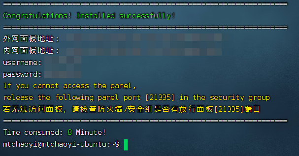

------
# 目录

- [目录](#目录)
- [自搭运行环境 - Tomcat](#自搭运行环境---tomcat)
  - [Step1 - 安装java环境](#step1---安装java环境)
  - [Step2 - 安装Tomcat](#step2---安装tomcat)
- [使用宝塔](#使用宝塔)
  - [安装宝塔](#安装宝塔)

------

# 自搭运行环境 - Tomcat
## Step1 - 安装java环境
**1. 官网下载JDK [Java Downloads](https://www.oracle.com/java/technologies/downloads/)
  &emsp;本次使用jdk-1.8.0_401**

**2. 解压jdk**
- 在 /usr/lib 目录下创建 jvm 文件夹来保存 JDK 文件：
  ```
  cd /usr/lib
  ```
  ```
  sudo mkdir jvm
  ```
- 解压缩之前的 JDK 文件到上述目录中：
  ```
  cd ~/Downloads
  ```
  ```
  sudo tar -zxvf ./jdk-8u401-linux-x64.tar.gz -C /usr/lib/jvm
  ```
**3. 配置JDK环境变量**
- 打开 ~/.bashrc
  ```
  sudo nano ~/.bashrc
  ```
- 添加以下内容
    ```
    export JAVA_HOME=/usr/lib/jvm/jdk1.8.0_401
    export JRE_HOME=${JAVA_HOME}/jre
    export CLASSPATH=.:${JAVA_HOME}/lib:${JRE_HOME}/lib
    export PATH=${JAVA_HOME}/bin:$PATH
    ```
- 退出nona编辑器：
  ```
  Ctrl+X 保存，Y 确定保存，回车确定保存到文件
  ```
- 使环境变量生效：
  ```
  source ~/.bashrc
  ```
**4. 检验安装结果**
    ```
    java -version
    ```
  出现与以下结果类似则说明安装成功
  > hadoop@fzqs-computer:~$ java -version</br>
  > java version "1.8.0_301"</br>
  > Java(TM) SE Runtime Environment (build 1.8.0_301-b09)</br>
  > Java HotSpot(TM) 64-Bit Server VM (build 25.301-b09, mixed mode)

## Step2 - 安装Tomcat
**1. 官网或仓库下载Tomcat [Apache Tomcat](https://tomcat.apache.org/) | [wget仓库](https://www-eu.apache.org/dist/tomcat/)
   &emsp;本次安装Tomcat-9.0.68**
**2. 解压缩之前下载的 Tomcat 文件到 /opt 目录中：**

  ```
  cd ~/Downloads
  ```
  ```
  sudo tar -zxvf ./apache-tomcat-9.0.68.tar.gz -C /opt/
  ```
**3. 在 Tomcat bin目录下的 shell 脚本必须可执行：**

  ```
  sudo sh -c 'chmod +x /opt/apache-tomcat-9.0.68/bin/*.sh'
  ```
**4. 创建 SystemD 单元文件**
  &emsp;与使用 shell 脚本来启动和停止 Tomcat 服务器相比，我们将会将它作为服务来运行。
- 打开文本编辑器，并且在 /etc/systemd/system/ 目录下创建一个 tomcat.service 单元文件。
  ```
  sudo nano /etc/systemd/system/tomcat.service
  ```
- 粘贴下面的配置文件（用户名和用户组需改成自己的）
    ```
    [Unit]
    Description=Tomcat 9 servlet container
    After=network.target

    [Service]
    Type=forking

    User=用户名
    Group=用户组

    Environment="JAVA_HOME=/usr/lib/jvm/jdk1.8.0_401"
    Environment="JAVA_OPTS=-Djava.security.egd=file:///dev/urandom -Djava.awt.headless=true"

    Environment="CATALINA_BASE=/opt/apache-tomcat-9.0.68"
    Environment="CATALINA_HOME=/opt/apache-tomcat-9.0.68"
    Environment="CATALINA_PID=/opt/apache-tomcat-9.0.68/temp/tomcat.pid"
    Environment="CATALINA_OPTS=-Xms512M -Xmx1024M -server -XX:+UseParallelGC"

    ExecStart=/opt/apache-tomcat-9.0.68/bin/startup.sh
    ExecStop=/opt/apache-tomcat-9.0.68/bin/shutdown.sh

    [Install]
    WantedBy=multi-user.target
    ```
- 保存并且关闭文件，通知 systemd 一个新的单元文件存在：
  ```
  sudo systemctl daemon-reload
  ```
- 启用并且启动 Tomcat 服务：
  ```
  sudo systemctl enable --now tomcat
  ```
- 检查服务状态：
  ```
  sudo systemctl status tomcat
  ```
- 输出应该显示 Tomcat 服务器已经启用，并且运行了：
  > tomcat.service - Tomcat 9 servlet container</br>
  > Loaded: loaded (/etc/systemd/system/tomcat.service; enabled; vendor preset: enabled)</br>
  > Active: active (running) since Mon 2020-05-25 17:58:37 UTC; 4s ago</br>
  > Process: 5342 ExecStart=/opt/tomcat/latest/bin/startup.sh (code=exited, status=0/SUCCESS)</br>
  > Main PID: 5362 (java)</br>
  >&emsp;. . .

**5. 你可以 像其他 systemd 服务一样 启动，停止和重启 Tomcat：**
  ```
  sudo systemctl start tomcat
  ```
  ```
  sudo systemctl stop tomcat
  ```
  ```
  sudo systemctl restart tomcat
  ```
**6. Tomcat默认端口为 8080**

# 使用宝塔

## 安装宝塔

> 安装脚本
> ```
> wget -O install.sh http://download.bt.cn/install/install-ubuntu_6.0.sh && sudo bash install.sh ed8484bec
> ```

**一路回车直到显示**

<div align=center></div>
