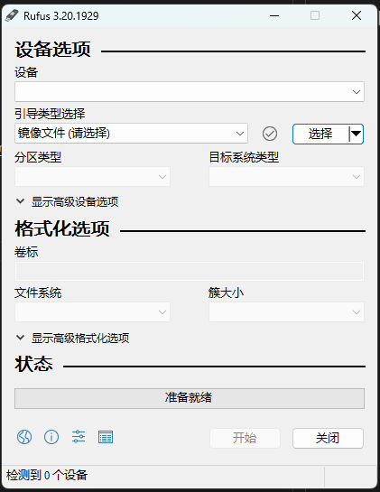
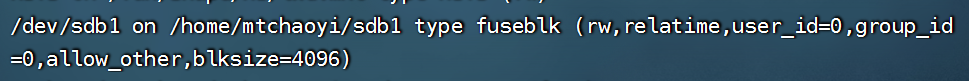

------
# 目录

- [目录](#目录)
- [Ubuntu安装](#ubuntu安装)
  - [Step1 - 安装前准备](#step1---安装前准备)
  - [Step2 - 写系统安装U盘](#step2---写系统安装u盘)
  - [Step3 - 安装 Ubuntu Server](#step3---安装-ubuntu-server)
- [Ubuntu基础配置](#ubuntu基础配置)
  - [切换中文语言](#切换中文语言)
  - [硬盘挂载](#硬盘挂载)
  - [Samba共享挂载的硬盘](#samba共享挂载的硬盘)
  - [设置定时重启](#设置定时重启)
  - [清理硬盘空间](#清理硬盘空间)
  - [连接zerotier局域网](#连接zerotier局域网)
  - [安装xrdp远程桌面(桌面没啥用)](#安装xrdp远程桌面桌面没啥用)

------

# Ubuntu安装

## Step1 - 安装前准备
> + 一台低功耗闲置主机
> + 一个4G以上U盘
> + Ubuntu镜像文件 [官网](https://cn.ubuntu.com/download)|[阿里云](https://mirrors.aliyun.com/ubuntu-releases/)
> + [Rufus](https://rufus.ie/zh/) 轻松创建USB启动盘

## Step2 - 写系统安装U盘
**1. 打开Rufus**

<div align=center></div>


**2. 将系统写入U盘**

<div align=center></div>


## Step3 - 安装 Ubuntu Server

**1. 将U盘插入闲置主机**

**2. 开机，选择从U盘启动**

> **后续步骤用虚拟机演示**

**3. 选择English**

<div align=center></div>

**4. 选择键盘，默认即可**

<div align=center></div>

**5. 选安装方式，默认即可**

<div align=center></div>

**6. 选择网络**

<div align=center></div>

**7. 选择代理，默认即可**

<div align=center></div>

**8. 选择镜像仓库，推荐修改为国内镜像，例如阿里云的镜像**
```
http://mirrors.aliyun.com/ubuntu
```
<div align=center></div>

**9. 磁盘分区方式**

<div align=center></div>

+ 一般默认即可
+ 如果选择手动分区
  + 500G及以上硬盘推荐配置
  <div align=center></div>

  + 100G左右硬盘推荐配置
  <div align=center></div>

**10. 填写用户名密码等信息**

<div align=center></div>

**11. 安装ssh，推荐安装**

<div align=center></div>

**12. 等待安装完成**

<div align=center></div>

> 出现 Reboot Now 即安装完成，回车确认重启</br>
> 如果卡在某条语句一直没反应可断网重新安装系统

------
# Ubuntu基础配置

> ssh/ftp软件：[FinalShell](http://www.hostbuf.com/t/988.html)

## 切换中文语言

- 区域设置
    ```
    sudo dpkg-reconfigure locales
    ```
- 向下翻,在靠近末尾的位置找到 `zh_CN.UTF-8 UTF-8` , 用 `空格键` 选中前面会添上 `*` ,然后回车键
  <div align=center></div>

- 再次选择 `zh_CN.UTF-8` , 然后回车完成设置
  <div align=center></div>

  <div align=center></div>

- 重启系统
  ```
  sudo reboot
  ```

- 重启后,如果有发现本该显示中文的地方出现了方块乱码,则还需要安装字体来支持中文
  ```
  sudo apt install ttf-wqy-microhei ttf-wqy-zenhei xfonts-intl-chinese
  ```

## 硬盘挂载

**1. 查看未挂载硬盘**

```
sudo fdisk -l
```
<div align=center></div>

**2. 将磁盘挂载在某个地方**

- `mount /dev/sdb1 需要挂载的路径`需要挂载的路径必须存在
<div align=center></div>

- 出现`Could not mount read-write, trying read-only`说明挂载读写失败，以只读挂载成功
  - 取消挂载
    ```
    umount /dev/sdb1
    ```
  - 修复硬盘
    ```
    sudo ntfsfix /dev/sdb1
    ```
    <div align=center></div>
  - 重新挂载硬盘
    ```
    sudo mount -t ntfs /dev/sdb1 /home/mtchaoyi/sdb1
    ```
  - 查看挂载情况
    ```
    mount
    ```
    <div align=center></div>
**3. 设置开机自动挂载**

- 查看硬盘UUID
  ```
  sudo blkid /dev/sdb1
  ```
  <div align=center></div>
- 修改fstab
  ```
  sudo nano /etc/fstab
  ```
- 在最后一行添加
  ```
  UUID=XXXX  挂载路径  ntfs  defaults 0  2
  ```

## Samba共享挂载的硬盘
- 安装samba服务
  ```
  sudo apt install samba
  ```
- samba配置
  ```
  sudo vim /etc/samba/smb.conf
  ```
- 在smb.conf最后添加
  ```
  [share]
    path = /home/mtchaoyi/sda1
    available = yes
    browseable = yes
    writable = yes
  ```
<div align=center></div>

- 创建使用该共享文件的账号
  ```
  sudo smbpasswd -a mtchaoyi
  ```
- 重启samba服务
  ```
  sudo service smbd restart
  ```

## 设置定时重启
- 编辑crontab
  ```
  crontab -e
  ```
- 添加定时任务，以下的意思是：0分3点执行重启。
  ```
  0 3 * * * /sbin/reboot
  ```
  `m h day mon week command`
  |参数|意义|取值范围|
  |:---:|:---:|:---:|
  |m|分钟|0-59|
  |h|小时|0-23|
  |day|天|1-31|
  |mon|月|1-12|
  |week|星期|0-6 ，0表示星期天|
  |command|要执行的命令|——|
- 重启服务
  ```
  sudo service cron restart
  ```
- 查看所有定时任务
  ```
  crontab -l
  ```

## 清理硬盘空间
- 查看硬盘空间占用情况
  ```
  df -h
  ```
<div align=center></div>

- 跳转到需要清理空间的挂载点，查看最大占用的一级目录
  ```
  sudo du --max-depth=1 -h
  ```


## 连接zerotier局域网
- 安装zerotier
  ```
  curl -s https://install.zerotier.com | sudo bash
  ```
- 加入zerotier局域网
  ```
  sudo zerotier-cli join 你的network ID
  ```
- 登入zerotier官网，进入你的局域网，在Ubuntu前面打勾，授权
  <div align=center></div>

## 安装xrdp远程桌面(桌面没啥用)
- 运行下面任何一个命令去安装你选择的桌面环境
  - 安装 Gnome
    ```
    sudo apt update
    sudo apt install ubuntu-desktop
    ```
  - 安装 Xfce
    ```
    sudo apt update
    sudo apt install xubuntu-desktop
    ```
- 安装 Xrdp
  ```
  sudo apt install xrdp
  ```
- 将用户添加到ssl-cert用户组
  ```
  sudo adduser mtchaoyi ssl-cert
  ```
- 重启 Xrdp 服务，使得修改生效
  ```
  sudo systemctl restart xrdp
  ```