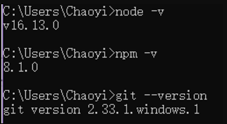
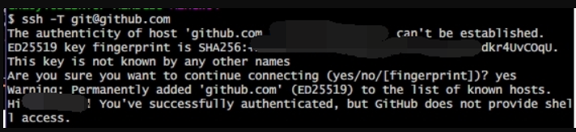
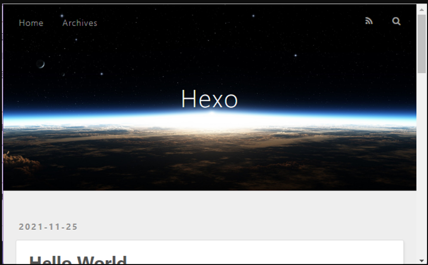
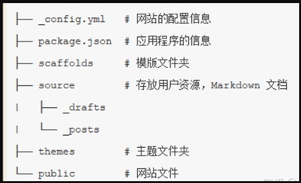

------
# 目录

- [目录](#目录)
- [环境搭建](#环境搭建)
- [连接 Github](#连接-github)
- [创建 Github Pages 仓库](#创建-github-pages-仓库)
- [本地安装 Hexo 博客程序](#本地安装-hexo-博客程序)
  - [安装 Hexo](#安装-hexo)
  - [Hexo 初始化和本地预览](#hexo-初始化和本地预览)
- [部署 Hexo 到 GitHub Pages](#部署-hexo-到-github-pages)
- [绑定域名（可选）](#绑定域名可选)
  - [域名注册和解析](#域名注册和解析)
  - [绑定域名到 Hexo 博客](#绑定域名到-hexo-博客)
- [开始使用](#开始使用)
  - [发布文章](#发布文章)
  - [网站设置](#网站设置)
  - [更换主题](#更换主题)
  - [常用命令](#常用命令)
- [常见问题](#常见问题)

------
# 环境搭建
Hexo 基于 Node.js，搭建过程中还需要使用 npm（Node.js 已带） 和 git，因此先搭建本地操作环境，安装 Node.js 和 Git。

- Node.js：https://nodejs.org/zh-cn
- Git：https://git-scm.com/downloads

下载 Node.js 和 Git 程序并安装，一路点 “下一步” 按默认配置完成安装。

安装完成后, `Win+R` 输入 `cmd` 并打开，依次输入 `node -v`、`npm -v` 和 `git --version` 并回车，如下图出现程序版本号即可。
<div align=center></div>

# 连接 Github

> **使用邮箱注册 [GitHub](https://github.com/) 账户，选择免费账户（Free），并完成邮件验证。**

- 打开 Git Bash，设置用户名和邮箱：
  ```
  git config --global user.name "GitHub 用户名"
  ```
  ```
  git config --global user.email "GitHub 邮箱"
  ```

- 创建 SSH 密匙：
  ```
  ssh-keygen -t rsa -C "GitHub 邮箱"
  ```
  然后一路回车。

- 添加密匙：<br>
  进入 [C:\Users\用户名\.ssh] 目录（要勾选显示“隐藏的项目”），用记事本打开公钥 id_rsa.pub 文件并复制里面的内容。

- 登陆 GitHub ，进入 Settings 页面，选择左边栏的 SSH and GPG keys，点击 New SSH key。

- Title 随便取个名字，粘贴复制的 id_rsa.pub 内容到 Key 中，点击 Add SSH key 完成添加。

- 验证连接：<br>
  打开 Git Bash，输入 `ssh -T git@github.com` 出现 *Are you sure……*，输入 `yes` 回车确认。

  <div align=center></div>
  显示 *Hi xxx! You've successfully……* 即连接成功。

# 创建 Github Pages 仓库
GitHub 主页右上角加号 -> New repository：

Repository name 中输入
```
用户名.github.io
```
Description 选填<br>
勾选 *Add a README file*<br>
填好后点击 Create repository 创建。<br>
**创建后默认自动启用 HTTPS，博客地址为: `https://用户名.github.io`**

# 本地安装 Hexo 博客程序
新建一个文件夹用来存放 Hexo 的程序文件，如 Hexo-Blog。打开该文件夹，右键 -> Git Bash Here。

## 安装 Hexo
使用 npm 一键安装 Hexo 博客程序：<br>

```
npm install -g hexo-cli
```
Mac 用户需要管理员权限（sudo），运行这条命令：<br>

```
sudo npm install -g hexo-cli
```
安装时间有点久，界面也没任何反应，**耐心等待**

## Hexo 初始化和本地预览
初始化并安装所需组件：<br>
```
hexo init    # 初始化
```
```
npm install   # 安装组件
```
完成后依次输入下面命令，启动本地服务器进行预览：<br>
```
hexo g    # 生成页面
```
```
hexo s    # 启动预览
```
访问 http://localhost:4000, 出现 Hexo 默认页面，本地博客安装成功！

<div align=center></div>

**Tips：** 如果出现页面加载不出来，可能是端口被占用了。*Ctrl+C* 关闭服务器，运行 `hexo server -p 5000` 更改端口号后重试。<br><br>

**Hexo 博客文件夹目录结构如下：**
<div align=center></div>

# 部署 Hexo 到 GitHub Pages
本地博客测试成功后，就是上传到 GitHub 进行部署，使其能够在网络上访问。
- 首先安装 hexo-deployer-git：
```
npm install hexo-deployer-git --save
```

- 然后修改 `_config.yml` 文件末尾的 Deployment 部分，修改成如下：
```
deploy:
  type: git
  repository: git@github.com:用户名/用户名.github.io.git
  branch: main
```

- 完成后运行 hexo d 将网站上传部署到 GitHub Pages。

这时访问我们的 GitHub 域名 `https://用户名.github.io` 就可以看到 Hexo 网站了

# 绑定域名（可选）
博客搭建完成使用的是 GitHub 的子域名`用户名.github.io`，我们可以为 Hexo 博客绑定自己的域名替换 GitHub 域名，更加个性化和专业，也利于 SEO。

## 域名注册和解析
在 DNS 设置部分添加 CNAME 记录将 `www` 域名解析指向 `用户名.github.io`。

## 绑定域名到 Hexo 博客
- 进入本地博客文件夹的 source 目录，打开记事本，里面输入自己的域名，如 `www.xxx.com`，保存名称为 “CNAME”，格式为 “所有文件”（无 .txt 后缀）。
- 清除缓存等文件并重新发布网站：
  ```
  hexo clean    # 清除缓存文件等
  ```
  ```
  hexo d    #重新部署 Hexo 到 GitHub Pages
  ```
等待十分钟左右就可以使用自己的域名访问 Hexo 博客了。

# 开始使用

## 发布文章
进入博客所在目录，右键打开 Git Bash Here，创建博文：
```
hexo new "My New Post"
```
然后 source 文件夹中会出现一个 *My New Post.md* 文件，就可以使用 Markdown 编辑器在该文件中撰写文章了。<br>
写完后运行下面代码将文章渲染并部署到 GitHub Pages 上完成发布。以后每次发布文章都是这两条命令。
```
hexo g    # 生成页面
```
```
hexo d    # 部署发布
```
也可以不使用命令自己创建 .md 文件，只需在文件开头手动加入如下格式 Front-matter 即可，写完后运行 `hexo g` 和 `hexo d` 发布。
```
---
title: Hello World # 标题
date: 2019/3/26 hh:mm:ss # 时间
categories: # 分类
- Diary
tags: # 标签
- PS3
- Games
---

摘要
&lt;!--more--&gt;
正文
```

**注意：冒号后要加一个空格！**
## 网站设置
包括网站名称、描述、作者、链接样式等，全部在网站目录下的 `_config.yml` 文件中，参考 [官方文档](https://hexo.io/zh-cn/docs/configuration) 按需要编辑。

## 更换主题
在 [Themes | Hexo](https://hexo.io/themes/) 选择一个喜欢的主题，比如 NexT，进入网站目录打开 Git Bash Here 下载主题：<br>

```
git clone https://github.com/iissnan/hexo-theme-next themes/next
```
然后修改 `_config.yml` 中的 theme 为新主题名称 next，发布。（有的主题需要将 `_config.yml` 替换为主题自带的，参考主题说明。）

## 常用命令
```
hexo new "name"       # 新建文章
hexo new page "name"  # 新建页面
hexo g                # 生成页面
hexo d                # 部署
hexo g -d             # 生成页面并部署
hexo s                # 本地预览
hexo clean            # 清除缓存和已生成的静态文件
hexo help             # 帮助
```

# 常见问题
- 1.Hexo 设置显示文章摘要，首页不显示全文<br>
Hexo 主页文章列表默认会显示文章全文，浏览时很不方便，可以在文章中插入 `<!--more-->` 进行分段。<br>
该代码前面的内容会作为摘要显示，而后面的内容会替换为 *Read More* 隐藏起来。

- 2.设置网站图标<br>
进入 themes/主题 文件夹，打开 `_config.yml` 配置文件，找到 favicon 修改，一般格式为：favicon: 图标地址。（不同主题可能略有差别）

- 3.修改并部署后没有效果<br>
使用 hexo clean 清理后重新部署。

- 4.开启 HTTPS 后访问网站显示连接不安全？<br>
证书还未部署生效，等待一会儿，清除浏览器缓存再试。

- 5.Mac 安装 Hexo 报错无法安装<br>
Mac 用户需要管理员权限运行，使用 sudo npm install -g hexo-cli 命令安装。

- 6.npm 下载速度慢，甚至完全没反应<br>
使用 npm 安装程序等待很久也没反应，或者下载速度很慢，可以更换 npm 源为国内 npm 镜像。<br>
临时更换方法：在 npm 安装命令后面加上：<br>
  ```
  --registry https://registry.npm.taobao.org
  ```
----------------------------------
参考资料：知乎 [@crystal](https://www.zhihu.com/people/crystal-33-50)<br>[使用 Hexo+GitHub 搭建个人免费博客教程（小白向）](https://zhuanlan.zhihu.com/p/60578464#:~:text=%E4%BD%BF%E7%94%A8%20Hexo%2BGitHub%20%E6%90%AD%E5%BB%BA%E4%B8%AA%E4%BA%BA%E5%85%8D%E8%B4%B9%E5%8D%9A%E5%AE%A2%E6%95%99%E7%A8%8B%EF%BC%88%E5%B0%8F%E7%99%BD%E5%90%91%EF%BC%89%201%20%E5%87%86%E5%A4%87%202%20%E8%BF%9E%E6%8E%A5%20Github....,Hexo%20%E5%88%B0%20GitHub%20Pages%206%20%E7%BB%91%E5%AE%9A%E5%9F%9F%E5%90%8D%EF%BC%88%E5%8F%AF%E9%80%89%EF%BC%89....%207%20%E5%BC%80%E5%A7%8B%E4%BD%BF%E7%94%A8)