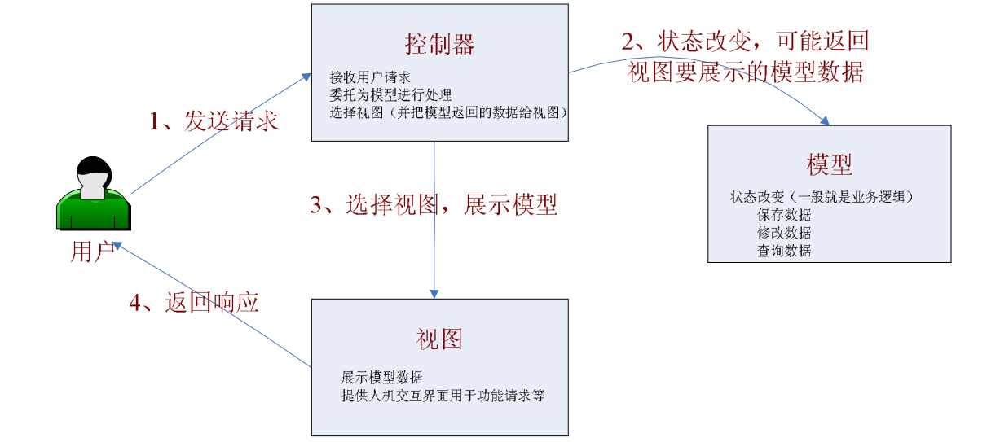
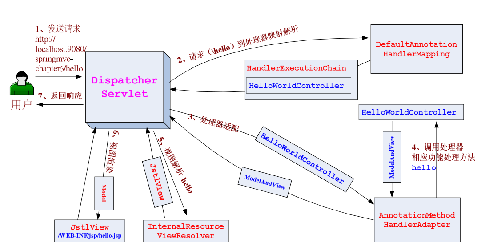
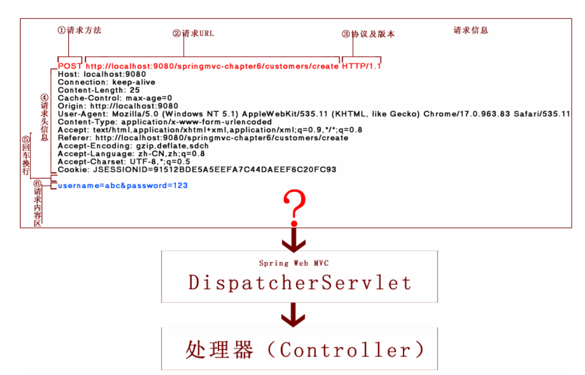

# Web MVC 简介

##  Web 开发中的请求- 响应模型


在 Web 世界里：
都是 Web 客户端发起请求，Web 服务器接收、处理并产生响应。一般 Web 服务器是不能主动通知 Web 客户端更新内容。虽然现在有些技术如服务器推（如 Comet）、还有现在的 HTML5 websocket 可以实现 Web 服务器主动通知 Web 客户端。

## MVC 概述

> MVC英文是Model View Controller，是**模型(model)－视图(view)－控制器(controller)**的缩写，一种软件设计规范。本质上也是一种**解耦**。

> MVC 模型：是一种**架构型的模式**，本身不引入新功能，只是帮助我们将开发的结构组织的更加合理，使展示与模型分离、流程控制逻辑、业务逻辑调用与展示逻辑分离。


- Model （模型）：数据模型，提供要展示的数据，因此包含数据和行为，可以认为是领域模型或 JavaBean 组件（包含数据和行为），不过现在一般都分离开来：Value Object（数据） 和服务层（行为）。也就是模型提供了模型数据查询和模型数据的状态更新等功能，包括数据和业务。
- View （视图）：负责进行模型的展示，一般就是我们见到的用户界面，客户想看到的东西。
- Controller （控制器）：接收用户请求，委托给模型进行处理（状态改变），处理完毕后把返回的模型数据返回给视图，由视图负责展示。 也就是说控制器做了个调度员的工作。

## Web MVC 概述

> 模型-视图-控制器概念和标准 MVC 概念一样



在 Web MVC 模式下，模型无法主动推数据给视图，如果用户想要视图更新，需要再发送一次请求（即请求-响应模型）。

## Web 端开发发展历程


-  CGI：（Common Gateway Interface）公共网关接口，一种在 web 服务端使用的脚本技术，使用 C 或 Perl 语言编写，用于接收 web 用户请求并处理，最后动态产生响应给用户，但每次请求将产生一个进程，重量级。
- Servlet：一种 JavaEE web 组件技术，是一种在服务器端执行的 web 组件，用于接收 web 用户请求并处理，最后动态产生响应给用户。但每次请求只产生一个线程（而且有线程池），轻量级。而且能利用许多 JavaEE 技术（如 JDBC等）。本质就是在 java 代码里面 输出 html 流。但表现逻辑、控制逻辑、业务逻辑调用混杂。
- JSP（Java Server Page）：一种在服务器端执行的 web 组件，是一种运行在标准的 HTML 页面中嵌入脚本语言（现在只支持 Java）的模板页面技术。本质就是在 html 代码中嵌入 java 代码。JSP 最终还是会被编译为 Servlet，只不过比纯 Servlet 开发页面更简单、方便。但表现逻辑、控制逻辑、业务逻辑调用还是混杂。
- Model1 ：可以认为是 JSP 的增强版，可以认为是 jsp+javabean，使用\<jsp:useBean\>标准动作可以简化 javabean 的获取/创建，及将请求参数封装到 javabean。
-  Model2 ：在 JavaEE 世界里，它可以认为就是 Web MVC 模型
  Model2 架构其实可以认为就是我们所说的 Web MVC 模型，只是控制器采用 Servlet、模型采用 JavaBean、视图采用 JSP。


可能不同的 web 层框架在细节处理方面不同，但的目的是一样的：

- 干净的 web 表现层：
  - 模型和视图的分离；
  - 控制器中的控制逻辑与功能处理分离（收集并封装参数到模型对象、业务对象调用）；
  - 控制器中的视图选择与具体视图技术分离。
- 轻薄的 web 表现层：
  - 做的事情越少越好，薄薄的，不应该包含无关代码；
  - 只负责收集并组织参数到模型对象，启动业务对象的调用；
  - 控制器只返回逻辑视图名并由相应的应用控制器来选择具体使用的视图策略；
  - 尽量少使用框架特定 API，保证容易测试。

# Spring MVC 入门

> Spring Web MVC 是一种基于 Java 的实现了 Web MVC 设计模式的请求驱动类型的轻量级 Web 框架，即使用了 MVC 架构模式的思想，将 web 层进行职责解耦，基于请求驱动指的就是使用请求-响应模型，框架的目的就是帮助我们简化开发，Spring Web MVC 也是要简化我们日常 Web 开发的。

## Spring Web MVC 架构

核心架构的具体流程步骤如下：

1. 首先用户发送请求——>DispatcherServlet，前端控制器收到请求后自己不进行处理，而是委托给其他的解析器进行处理，作为统一访问点，进行全局的流程控制；
2. DispatcherServlet——>HandlerMapping， HandlerMapping 将会把请求映射为 HandlerExecutionChain 对象（包含一个 Handler 处理器（页面控制器）对象、多个 HandlerInterceptor 拦截器）对象，通过这种策略模式，很容易添加新的映射策略；
3. DispatcherServlet——>HandlerAdapter，HandlerAdapter 将会把处理器包装为适配器，从而支持多种类型的处理器，即适配器设计模式的应用，从而很容易支持很多类型的处理器；
4. HandlerAdapter——>处理器功能处理方法的调用，HandlerAdapter 将会根据适配的结果调用真正的处理器的功能处理方法，完成功能处理；并返回一个 ModelAndView 对象（包含模型数据、逻辑视图名）；
5. ModelAndView 的逻辑视图名——> ViewResolver ， ViewResolver 将把逻辑视图名解析为具体的 View，通过这种策略模式，很容易更换其他视图技术；
6. View——>渲染，View 会根据传进来的 Model 模型数据进行渲染，此处的 Model 实际是一个 Map 数据结构，因此很容易支持其他视图技术；
7. 返回控制权给 DispatcherServlet，由 DispatcherServlet 返回响应给用户，到此一个流程结束。

# DispatcherServlet

## DispatcherServlet 初始化

1. 初始化 Spring Web MVC 使用的 Web 上下文，并且可能指定父容器为（ ContextLoaderListener 加载了根上下文）；
2. 初始化 DispatcherServlet 使用的策略，如 HandlerMapping、HandlerAdapter 等。

## DispatcherServlet 中使用的特殊的 Bean

1. Controller ：处理器/页面控制器，做的是 MVC 中的 C 的事情，但控制逻辑转移到前端控制器了，用于对请求进行处理；
2. HandlerMapping ：请求到处理器的映射，如果映射成功返回一个 HandlerExecutionChain 对象（包含一个 Handler处理器（页面控制器）对象、多个 HandlerInterceptor 拦截器）对象；如 BeanNameUrlHandlerMapping 将 URL 与Bean名字映射，映射成功的 Bean 就是此处的处理器；
3. HandlerAdapter ：HandlerAdapter 将会把处理器包装为适配器，从而支持多种类型的处理器，即适配器设计模式的应用，从而很容易支持很多类型的处理器；如 SimpleControllerHandlerAdapter 将对实现了 Controller 接口的Bean 进行适配，并且掉处理器的 handleRequest 方法进行功能处理；
4. ViewResolver ：ViewResolver将把逻辑视图名解析为具体的View，通过这种策略模式，很容易更换其他视图技术；如 InternalResourceViewResolver将逻辑视图名映射为jsp视图；
5. LocalResover ：本地化解析，因为 Spring 支持国际化，因此 LocalResover 解析客户端的 Locale 信息从而方便进行国际化；
6. ThemeResovler ：主题解析，通过它来实现一个页面多套风格，即常见的类似于软件皮肤效果；
7. MultipartResolver ：文件上传解析，用于支持文件上传；
8. HandlerExceptionResolver ： 处理器异常解析，可以将异常映射到相应的统一错误界面，从而显示用户友好的界面（而不是给用户看到具体的错误信息）；
9. RequestToViewNameTranslator ： 当处理器没有返回逻辑视图名等相关信息时，自动将请求 URL 映射为逻辑视图名；
10. FlashMapManager ： 用于管理 FlashMap 的策略接口，FlashMap 用于存储一个请求的输出，当进入另一个请求时作为该请求的输入，通常用于重定向场景，后边会细述。

# Controller 接口控制器

> Controller 控制器，是 MVC 中的部分 C，为什么是部分呢？因为此处的控制器主要负责功能处理部分：
> 1、收集、验证请求参数并绑定到命令对象；
> 2、将命令对象交给业务对象，由业务对象处理并返回模型数据；
> 3、返回 ModelAndView（Model 部分是业务对象返回的模型数据，视图部分为逻辑视图名

> 还记得 DispatcherServlet 吗？主要负责整体的控制流程的调度部分：
> 1、负责将请求委托给控制器进行处理；
> 2、根据控制器返回的逻辑视图名选择具体的视图进行渲染（并把模型数据传入）。
> **因此 MVC 中完整的 C（包含控制逻辑+功能处理）由（DispatcherServlet + Controller）组成。**

**因此此处的控制器是 Web MVC 中部分，也可以称为页面控制器、动作、处理器。**

## 注解式控制器

### Spring2.5 之前

> 我们都是通过实现 Controller 接口或其实现来定义我们的处理器

### Spring2.5

> 引入注解式处理器支持，通过 @Controller 和 @RequestMapping 注 解定义我们的处理器类。并且提供了一组强大的注解，需要通过处理器映射 DefaultAnnotationHandlerMapping 和处理器适配器 AnnotationMethodHandlerAdapter 来开启支持 @Controller 和 @RequestMapping 注解的处理器。

- @Controller： 用于标识是处理器类；
- @RequestMapping： 请求到处理器功能方法的映射规则；
- @RequestParam： 请求参数到处理器功能处理方法的方法参数上的绑定；
- @ModelAttribute： 请求参数到命令对象的绑定；
- @SessionAttributes： 用于声明 session 级别存储的属性，放置在处理器类上，通常列出模型属性（如@ModelAttribute）对应的名称，则这些属性会透明的保存到 session 中；
- @InitBinder： 自定义数据绑定注册支持，用于将请求参数转换到命令对象属性的对应类型；

### Spring3.0

> 引入 RESTful 架构风格支持（通过 @PathVariable 注解和一些其他特性支持），且又引入了更多的注解支持

- @CookieValue： cookie 数据到处理器功能处理方法的方法参数上的绑定；
- @RequestHeader： 请求头（header）数据到处理器功能处理方法的方法参数上的绑定；
- @RequestBody： 请求的 body 体的绑定（通过 HttpMessageConverter 进行类型转换）；
- @ResponseBody： 处理器功能处理方法的返回值作为响应体（通过 HttpMessageConverter 进行类型转换）；
- @ResponseStatus： 定义处理器功能处理方法/异常处理器返回的状态码和原因；
- @ExceptionHandler： 注解式声明异常处理器；
- @PathVariable： 请求 URI 中的模板变量部分到处理器功能处理方法的方法参数上的绑定，从而支持 RESTful 架构风格的 URI；

### Spring3.1

> 使用新的 HandlerMapping 和 HandlerAdapter 来支持 @Contoller 和 @RequestMapping 注解处理器 
>
> 新的@Contoller 和@RequestMapping 注解支持类：处理器映射 RequestMappingHandlerMapping 和处理器适配器
> RequestMappingHandlerAdapter 组合来代替 Spring2.5 开始的处理器映射 DefaultAnnotationHandlerMapping 和处理器适配器 AnnotationMethodHandlerAdapter，提供更多的扩展点。

## 注解使用示例
### 控制器实现

```java
package cn.javass.chapter6.web.controller;
// 省略import
@Controller // 或 @RequestMapping 		// ①将一个POJO类声明为处理器
public class HelloWorldController {
    @RequestMapping(value = "/hello") 	// ②请求URL到处理器功能处理方法的映射
    public ModelAndView helloWorld() {
        //1、收集参数		
        //2、绑定参数到命令对象
        //3、调用业务对象
        //4、选择下一个页面
        ModelAndView mv = new ModelAndView();
        //添加模型数据 可以是任意的POJO对象
        mv.addObject("message", "Hello World!");
        //设置逻辑视图名，视图解析器会根据该名字解析到具体的视图页面
        mv.setViewName("hello");
        return mv; 						// ③模型数据和逻辑视图名
    }
}
```

> ① 可以通过在一个 POJO 类上放置@Controller 或@RequestMapping，即可把一个 POJO 类变身为处理器；
> ② @RequestMapping(value = "/hello") 请求 URL(/hello) 到 处理器的功能处理方法的映射；
> ③ 模型数据和逻辑视图名的返回

### Spring 配置文件

- HandlerMapping 和 HandlerAdapter 的配置

  ```xml
  <!--Spring3.1开始的注解 HandlerMapping -->
  <bean class="org.springframework.web.servlet.mvc.method.annotation.RequestMappingHandlerMapping"/>
  <!--Spring3.1开始的注解 HandlerAdapter -->
  <bean
  class="org.springframework.web.servlet.mvc.method.annotation.RequestMappingHandlerAdapter"/>
  ```

- 视图解析器的配置

  > 还是使用之前的 org.springframework.web.servlet.view.InternalResourceViewResolver

- 处理器的配置

  ```xml
  <!-- 处理器 -->
  <bean class="cn.javass.chapter6.web.controller.HelloWorldController"/>
  ```

  > 只需要将处理器实现类注册到 spring 配置文件即可，spring 的 DefaultAnnotationHandlerMapping 或
  > RequestMappingHandlerMapping 能根据注解@Controller 或@RequestMapping 自动发现

### 视图页面

```jsp
<%@ page language="java" contentType="text/html; charset=UTF-8" pageEncoding="UTF-8"%>
<!DOCTYPE html PUBLIC "-//W3C//DTD HTML 4.01 Transitional//EN"
"http://www.w3.org/TR/html4/loose.dtd">
<html>
<head>
    <meta http-equiv="Content-Type" content="text/html; charset=UTF-8">
    <title>Hello World</title>
</head>
    <body>
    ${message}
    </body>
</html>
```

> ${message}：表示显示由HelloWorldController处理器传过来的模型数据

### 启动服务器测试

地址栏输入 http://localhost:9080/springmvc-chapter6/hello，我们将看到页面显示“Hello World!”，表示成功了。

## 运行流程



## 处理器定义

### @Controller

```java
@Controller
public class HelloWorldController {
	...
}
```

> 推荐使用这种方式声明处理器，它和我们的@Service、@Repository 很好的对应了我们常见的三层开发架构的组件

### @RequestMapping

```java
@RequestMapping
public class HelloWorldController {
	...
}
```

> 这种方式也是可以工作的，但如果在类上使用@ RequestMapping 注解一般是用于**窄化功能**处理方法的映射的

### 窄化请求映射

```java
package cn.javass.chapter6.web.controller;
@Controller
@RequestMapping(value="/user") 			// ①处理器的通用映射前缀
public class HelloWorldController2 {
    @RequestMapping(value = "/hello2") 	// ②相对于①处的映射进行窄化
    public ModelAndView helloWorld() {
    //省略实现
    }
}
```

> ①类上的@RequestMapping(value="/user") 表示处理器的通用请求前缀；
> ②处理器功能处理方法上的是对①处映射的窄化。

> 因此 http://localhost:9080/springmvc-chapter6/hello2 无法映射到 HelloWorldController2 的 helloWorld 功能处理方法；而
> http://localhost:9080/springmvc-chapter6/user/hello2 是可以的。

> 窄化请求映射可以认为是方法级别的@RequestMapping ，继承类级别的@RequestMapping

## 请求映射



- http 请求信息包含六部分信息：
  ① 请求方法，如 GET 或 POST，表示提交的方式；
  ② URL，请求的地址信息；
  ③ 协议及版本；
  ④ 请求头信息（包括 Cookie 信息）；
  ⑤ 回车换行（ CRLF ）；
  ⑥ 请求内容区（即请求的内容或数据），如表单提交时的参数数据、URL 请求参数（?abc=123 ？后边的）等。
- 想要了解 HTTP/1.1 协议，请访问 http://tools.ietf.org/html/rfc2616。
- 那此处我们可以看到有①、②、④、⑥一般是可变的，因此我们可以这些信息进行请求到处理器的功能处理方法的映射，因此请求的映射分为如下几种：
  - URL 路径映射：使用 URL 映射请求到处理器的功能处理方法；
  - 请求方法映射限定：如限定功能处理方法只处理 GET 请求；
  - 请求参数映射限定：如限定只处理包含“abc”请求参数的请求；
  - 请求头映射限定：如限定只处理“Accept=application/json”的请求。

### URL 路径映射

- 普通 URL 路径映射

  `@RequestMapping(value={"/test1", "/user/create"})`： 多个URL路径可以映射到同一个处理器的功能处理方法。

-  URI 模板模式映射
  - `@RequestMapping(value="/users/{userId}") `：{×××}占位符，请求的 URL 可以是 `/users/123456`或`/users/abcd`，通过@PathVariable 可以提取 URI 模板模式中的{×××}中的×××变量。
  - `@RequestMapping(value="/users/{userId}/create")`：这样也是可以的，请求的 URL 可以是`/users/123/create`。
  - `@RequestMapping(value="/users/{userId}/topics/{topicId}")`：这样也是可以的，请求的 URL 可以是`/users/123/topics/123`。

- Ant 风格的 URL 路径映射
  - `@RequestMapping(value="/users/**") `：可以匹配`/users/abc/abc`，但`/users/123`将会被【URI模板模式映射中的`/users/{userId}`模式优先映射到】
  - `@RequestMapping(value="/product?") `：可匹配`/product1`或`/producta`，但不匹配`/product`或`/productaa`
  - `@RequestMapping(value="/product*")` ：可匹配`/productabc`或`/product`，但不匹配`/productabc/abc`
  - `@RequestMapping(value="/product/*") `：可匹配`/product/abc`，但不匹配`/productabc`
  - `@RequestMapping(value="/products/**/{productId}")` ：可匹配`/products/abc/abc/123`或`/products/123`，也就是Ant风格和URI模板变量风格可混用

- 正则表达式风格的 URL 路径映射

  - 从 Spring3.0 开始支持正则表达式风格的 URL 路径映射，格式为`{变量名:正则表达式}`，这样我们就可以通过@PathVariable 提取模式中的`{×××：正则表达式匹配的值}`中的×××变量了。

  - `@RequestMapping(value="/products/{categoryCode:\\d+}-{pageNumber:\\d+}")` ： 可以匹配`/products/123-1`，但不能匹配`/products/abc-1`，这样可以设计更加严格的规则。

    > 正则表达式风格的 URL 路径映射是一种特殊的 URI 模板模式映射：
    > URI 模板模式映射是`{userId}`，不能指定模板变量的数据类型，如是数字还是字符串；
    > 正则表达式风格的 URL 路径映射，可以指定模板变量的数据类型，可以将规则写的相当复杂。

- 组合使用是或的关系

  如 `@RequestMapping(value={"/test1", "/user/create"})`组合使用是或的关系，即`/test1`或`/user/create`”请求 URL 路径都可以映射到@RequestMapping 指定的功能处理方法。

### 请求方法映射限定
